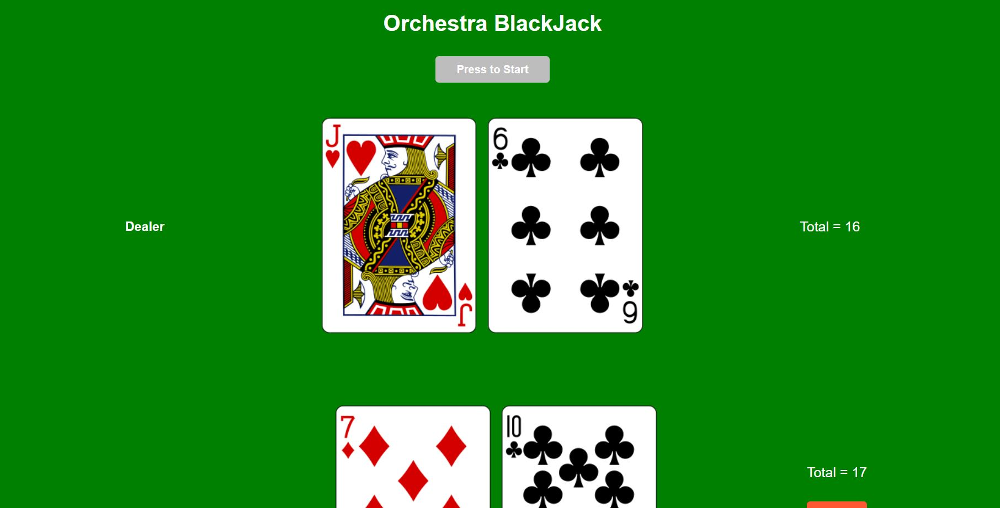

# Orchestra Blackjack

Simple blackjack web app consisting of two players: You Vs. The House(the computer), where the goal is to
beat the House's hand, without going over 21.

## Screenshots

### Desktop

## Technology Used

The project utilizes the following technologies:

- React
- Typescript
- Mobx
- Axios

Feel free to explore the project, and don't hesitate to reach out if you have any questions or feedback.
